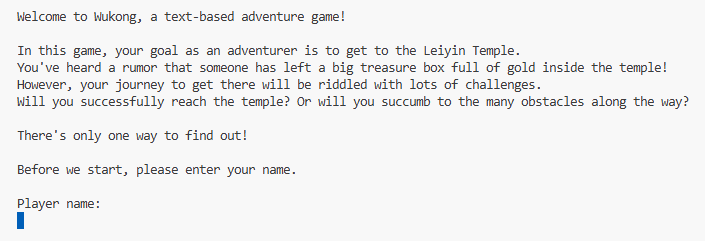

# Wukong

Text adventure game that runs in the terminal (command-line interface), inspired by the adventures of Sun Wukong from the Chinese mythological tale [Journey to the West](https://en.wikipedia.org/wiki/Journey_to_the_West). The objective of the game is to journey through different locations, battling various monsters, and ultimately reach the final destination: Leiyin Temple.  

**Tech Stack: Java**

## Project Credits
This project was developed collaboratively by a team of four developers: **Tashia Tamara / Myself, Tianfa Zhu, Ziying Ye, and Yang Cao**. It was originally created as an academic project at the Australian National University.  
This repository is a mirrored copy for portfolio purposes.

## General Game Rules
1. The game can be played by one player at a time.
2. The player can move by typing "go" followed by one of the following directions: north, east, south, west.
3. The player can use the command word "collect" every time they arrive at a new place in the map to search the place for useful items.
4. When encountering a monster, a turn-based combat is immediately activated. The player must select a weapon from their inventory to fight the monster. By default, the player will be equipped with a Wooden Stick at the start of the game.
5. During combat, the monster can kill the player. The player loses if their HP reaches 0. In this case, the game ends with the player's loss and they can restart the game to try again. 
6. The game ends and the player wins once they successfully reach the final destination: Leiyin Temple.

## General Game Controls
The game is run on the terminal and is controlled entirely using the keyboard.  
Command words that players can use include: go, quit, collect, guide, inventory, drop, map, inspect.  
Type the desired command word and press the Enter key to submit the command. 

**Command Words**
- go: Move the player in the chosen direction (north, east, south, west).
- quit: Stop playing the game.
- collect: Type "collect" to search an area for useful items.
- guide: Shows players a list of the valid command words.
- inventory: Shows players a list of the items in their inventory.
- drop: Drops an item from the inventory.
- map: Shows players their current location.
- inspect: Shows players more information about items in their inventory.

## Notable Game Features
1. Explorable Map: Players can explore various destinations all connected in one single map.
2. Turn and Time-Based Combat: Players engage in turn-based combat against various monsters. Each turn is also time-limited, adding pressure to quickly choose the appropriate weapon for the round.
3. Weight-Limited Inventory: The inventory has a weight limit, encouraging players to strategically decide which items to keep and which to drop.